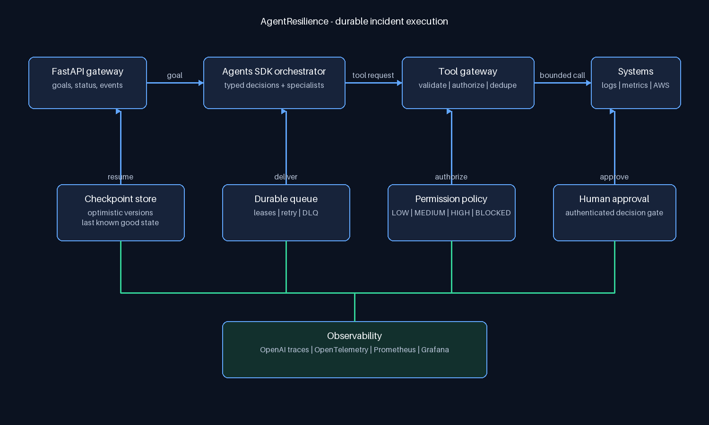
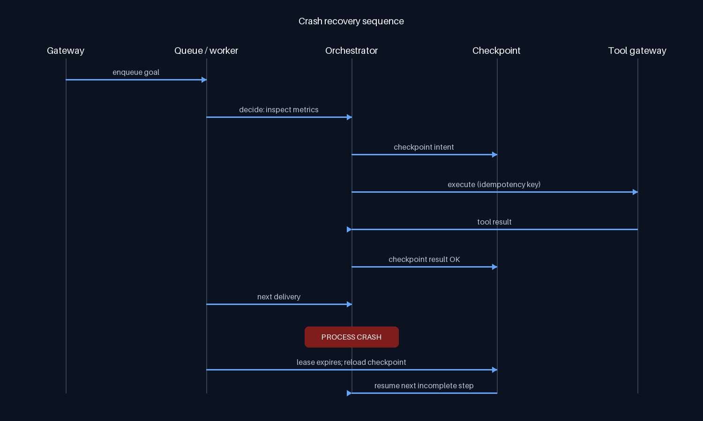

# AgentResilience

**A fault-tolerant runtime for reliable autonomous AI agents.**

AgentResilience investigates production incidents with an OpenAI Agents SDK orchestrator while keeping execution recoverable, idempotent, observable, and bounded by policy. A model can decide what evidence it needs; it cannot directly use infrastructure credentials or bypass the tool gateway.



## What is implemented

- **Resumable execution:** every agent decision and tool result is checkpointed in DynamoDB (AWS) or SQLite (local) with optimistic version checks. Each queue delivery performs one bounded action, so a replacement worker resumes at the next incomplete action.
- **Durable queue:** SQS receipt handles, continuously extended visibility leases, exponential retries, explicit DLQ transfer, and a compatible local queue.
- **Idempotent tools:** stable action IDs and persisted results prevent duplicate infrastructure calls after crashes or redelivery.
- **Agentic orchestration:** a typed Agents SDK orchestrator chooses the next action and can consult log-analysis, cloud-state, and remediation specialist agents.
- **Safety:** Pydantic argument validation, explicit risk policy, blocked operations, authenticated approval/rejection endpoints, and no infrastructure credentials in the model context.
- **Human approval:** production restart requests pause durably and continue only after an authorized approval. Rejection is a terminal, audited outcome.
- **Loop protection:** repeated tool cycles and repeated no-progress state fingerprints stop the workflow.
- **Real AWS tools:** read-only CloudWatch alarms, metrics and logs; ECS service health; and one approval-gated ECS `forceNewDeployment` remediation.
- **Observability:** append-only DynamoDB audit events, OpenAI agent traces, Prometheus/Grafana locally, optional OpenTelemetry, and a deployed CloudWatch dashboard with workflow, retry, latency, tool-failure, loop, SQS/DLQ, and ECS panels.
- **Evaluation:** 50 incident cases score task outcome, diagnosis, recovery after injected failures, evidence, safety, tool calls, retries, and P95 latency. `--live` evaluates the Agents SDK path.
- **Deployment:** separate Fargate API/worker services, an ALB, ECR, Secrets Manager injection, encrypted SQS/DLQ, DynamoDB, least-privilege task roles, alarms, and CI validation through Terraform.
- **Operations control plane:** responsive incident fleet view, live checkpoint/event streaming, evidence and audit timelines, approval controls, role-based viewer/administrator sessions, and audited DLQ replay.

Select adapters with `RUNTIME_BACKEND=sqlite|aws` and `TOOL_BACKEND=scenario|aws`. Local development remains self-contained; AWS deployment uses the production adapters without changing workflow logic.

## Failure coverage

| Failure | Runtime response |
|---|---|
| LLM timeout or downstream tool timeout | Retry with bounded exponential backoff |
| Invalid typed model/tool output | Reject and retry or fail permanently by category |
| Unauthorized or destructive action | Policy denial before execution |
| Process crash | Queue lease expires; another worker reloads the checkpoint |
| Duplicate delivery/tool request | Idempotency result is replayed, not the side effect |
| Repeated tool loop/no progress | Workflow stops as `LOOP_STOPPED` |
| Downstream unavailable repeatedly | Delivery moves to the DLQ; workflow becomes `DEAD_LETTERED` |
| Oversized accumulated evidence | Prompt is compacted to a configured evidence bound |
| Human rejection | Workflow becomes `HUMAN_REJECTED`; tool never runs |



## Local setup

Requires Python 3.11+.

```powershell
py -3.13 -m venv .venv
.venv\Scripts\python.exe -m pip install -e ".[dev]"
Copy-Item .env.example .env.local
```

Edit `.env.local` and add the project-scoped OpenAI key you created. The file is ignored by Git. For a zero-cost deterministic run, set `AGENT_MODE=deterministic`; no OpenAI request is made.

Run API and worker in separate terminals:

```powershell
.venv\Scripts\agent-resilience-api.exe
.venv\Scripts\agent-resilience-worker.exe
```

API docs are at `http://localhost:8000/docs`.

The operator dashboard is at `http://localhost:8000/`. Enter `ADMIN_API_TOKEN` for approval and replay controls, or `VIEWER_API_TOKEN` for a read-only session. Tokens stay in browser session storage and are not embedded in frontend assets.

## Exercise an incident

```powershell
$incident = Invoke-RestMethod -Method Post -Uri http://localhost:8000/v1/incidents `
  -ContentType application/json `
  -Body '{"goal":"Investigate why checkout-service has elevated production errors"}'

Invoke-RestMethod http://localhost:8000/v1/incidents/$($incident.task_id)

$headers = @{ Authorization = "Bearer $env:ADMIN_API_TOKEN" }
Invoke-RestMethod -Method Post -Uri "http://localhost:8000/v1/incidents/$($incident.task_id)/approve" `
  -Headers $headers -ContentType application/json -Body '{"actor":"on-call","reason":"evidence supports restart"}'
```

The incident proceeds through alert, metrics, logs, and dependency evidence; pauses before the high-risk production restart; then executes and verifies recovery after approval. Read its audit trail at `/v1/incidents/{task_id}/events`.

To demonstrate crash recovery, stop the worker after any `TOOL_COMPLETED` event and restart it. The expired/incomplete delivery is recovered and execution continues from the persisted state; completed tools are not run again.

## Test and evaluate

```powershell
.venv\Scripts\python.exe -m pytest -q
.venv\Scripts\python.exe evals/run_local.py
.venv\Scripts\python.exe evals/run_local.py --live --limit 3
```

Offline and live reports are written separately to `evals/results/latest.json` and `latest-live.json`. Results are ignored by Git so published numbers must come from an actual run.

## LocalStack integration and chaos tests

```powershell
docker compose -f docker-compose.localstack.yml up -d --wait
$env:AWS_ACCESS_KEY_ID = "test"
$env:AWS_SECRET_ACCESS_KEY = "test"
$env:AWS_DEFAULT_REGION = "us-east-1"
$env:RUN_LOCALSTACK_TESTS = "1"
$env:LOCALSTACK_ENDPOINT = "http://localhost:4566"
.venv\Scripts\python.exe -m pytest -q -m integration
```

The chaos test completes alert, metrics, and log collection, abandons the next SQS delivery as if the worker died, waits for visibility expiry, then proves a replacement worker resumes at dependency health with exactly four completed tools.

## AWS deployment

The Terraform module creates the complete runtime but defaults both ECS desired counts to zero so secrets and the container image can be populated safely before tasks start:

```powershell
Copy-Item infra/terraform/terraform.tfvars.example infra/terraform/terraform.tfvars
terraform -chdir=infra/terraform init
terraform -chdir=infra/terraform apply

# Build and push an immutable image tag to the ecr_repository_url output.
# Then publish ignored local credentials without displaying them:
.venv\Scripts\python.exe scripts/publish_aws_secrets.py `
  --openai-secret-id <openai_secret_arn> `
  --admin-secret-id <admin_secret_arn> `
  --viewer-secret-id <viewer_secret_arn> `
  --region us-east-1

terraform -chdir=infra/terraform apply `
  -var="container_image=<account>.dkr.ecr.us-east-1.amazonaws.com/agent-resilience-dev:<git-sha>" `
  -var="api_desired_count=2" -var="worker_desired_count=2"
```

Use private task subnets, NAT or VPC endpoints, HTTPS on the ALB, and a restricted `api_ingress_cidrs` value for a production deployment. See [infra/terraform/README.md](infra/terraform/README.md) for the full bootstrap and verification flow.

## Containers and monitoring

Docker Compose reads `.env`, not `.env.local`. Copy the example and set secure values before starting it:

```powershell
Copy-Item .env.example .env
docker compose up --build
```

- API and Swagger: `http://localhost:8000/docs`
- Prometheus: `http://localhost:9090`
- Grafana: `http://localhost:3000`

## Repository map

```text
agent_resilience/   API, agent orchestration, local/AWS stores, AWS tools, safety
tests/              local tests plus LocalStack integration and chaos tests
evals/              generated 50-case evaluation suite
fixtures/           deterministic incident/tool responses
ops/                Prometheus and Grafana configuration
infra/terraform/    AWS durable messaging, state, and monitoring primitives
docs/               system prompt and generated architecture diagrams
src/, test/         original Java proof of concept retained for history
```

## Security notes

- Never commit `.env` or `.env.local`.
- Set separate strong `ADMIN_API_TOKEN` and `VIEWER_API_TOKEN` values in any shared environment.
- Restrict `operations_service_arns` and `operations_log_group_arns` to the exact resources the agent is allowed to touch; never expose AWS credentials to prompts.
- Terminate TLS and add your organization identity layer in front of the API before production use.

## OpenAI implementation references

The integration follows the official [Agents SDK quickstart](https://developers.openai.com/api/docs/guides/agents/quickstart), [orchestration](https://developers.openai.com/api/docs/guides/agents/orchestration), [guardrails and approvals](https://developers.openai.com/api/docs/guides/agents/guardrails-approvals), [tracing](https://developers.openai.com/api/docs/guides/agents/integrations-observability), and [agent evals](https://developers.openai.com/api/docs/guides/agent-evals) guidance.

## License

MIT
